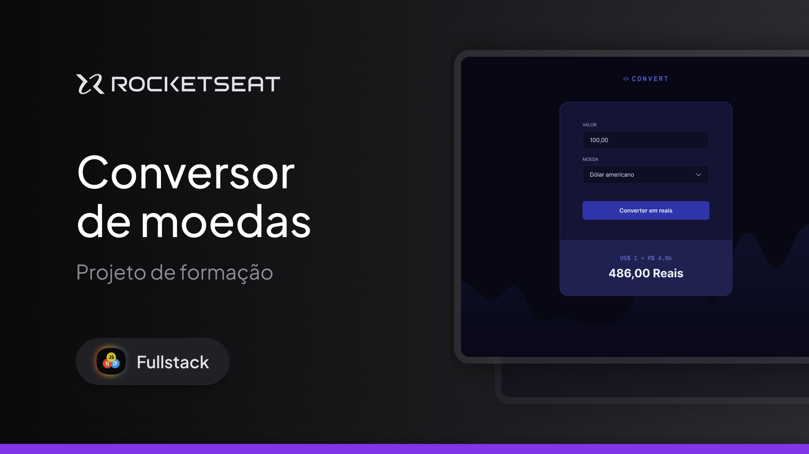

<h1 align="center"> Convert App  </h1>

Convert is a currency converter developed as part of the Rocketseat Fullstack course, completing the first module of JavaScript. It allows users to convert values between different currencies quickly and easily. Currently, exchange rates are updated manually to ensure accuracy while I strengthen my JavaScript knowledge.

During development, I practiced DOM manipulation, mathematical calculations, and best practices for code organization, preparing the project for future improvements, such as API implementation for automatic exchange rate updates.

  <a href="#-tecnologias">Technologies</a>&nbsp;&nbsp;&nbsp;|&nbsp;&nbsp;&nbsp;
  <a href="#-projeto">Project</a>&nbsp;&nbsp;&nbsp;|&nbsp;&nbsp;&nbsp;
  <a href="#-layout">Layout</a>&nbsp;&nbsp;&nbsp;|&nbsp;&nbsp;&nbsp;
  <a href="#memo-licença">License</a>

  

 

  

## 🚀 Technologies
This project was developed with the following technologies:
- HTML, CSS and JavaScript
- DOM Manipulation
- Git & GitHub
- Figma
- Responsively

## 💻 Project
Convert is a currency converter that allows users to enter a value, select the source and target currency, and obtain the conversion result.

- [Access the finished project](https://andreskull2.github.io/convert/)
- [Watch the classes](https://www.rocketseat.com.br/formacao/fullstack)

## 🔖 Layout
You can view the project layout through [LINK](https://www.figma.com/community/file/1360315742205904074). A Figma account is required to access it. [Figma](https://figma.com).

## :memo: License
This project is licensed under the MIT License.

---
Made with ♥ by Rocketseat :wave: [Join our community!](https://discord.gg/rocketseat)